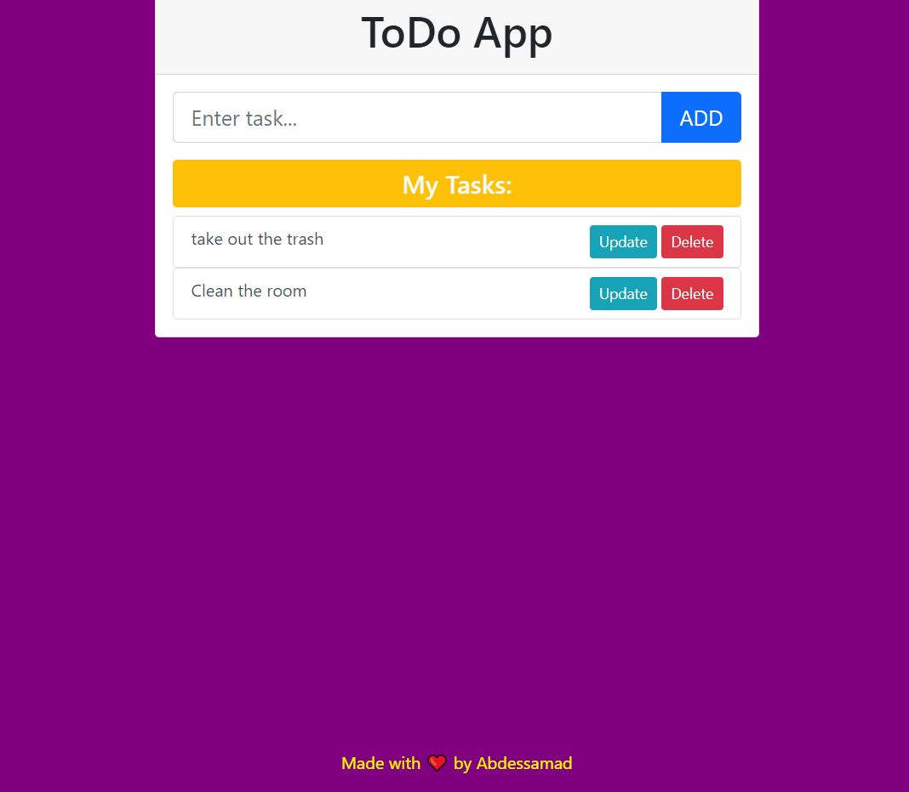
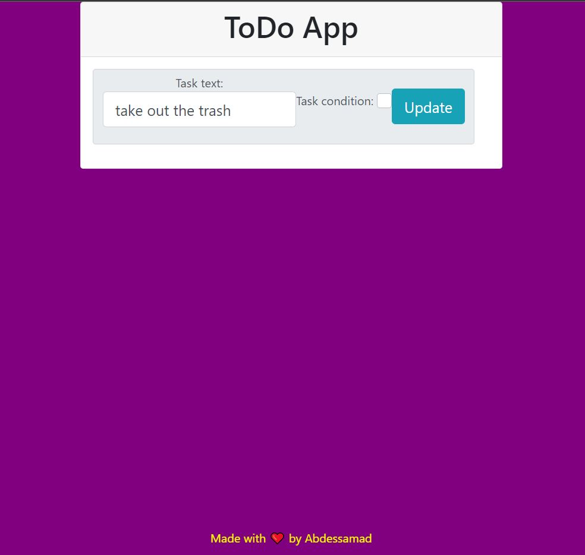

### Readme app made with django 

the user can update,add and delete the tasks 



make sure you have djnago and python installed before using the code 
next in a terminal run the following

`````terminal
$ venv/Scripts/activate
$ cd todoapp
$ python manage.py run server 
`````
finally access the localhoast and here you have a to do app 
